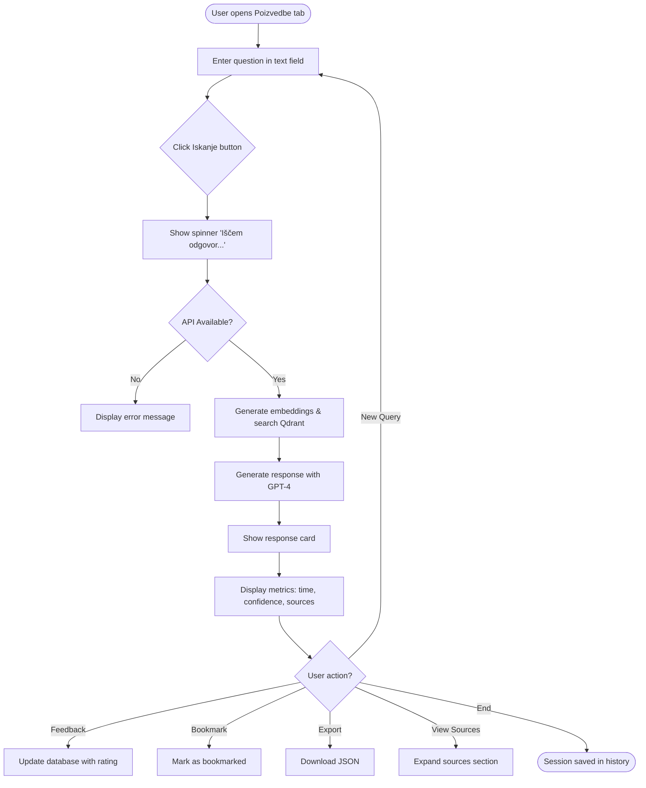
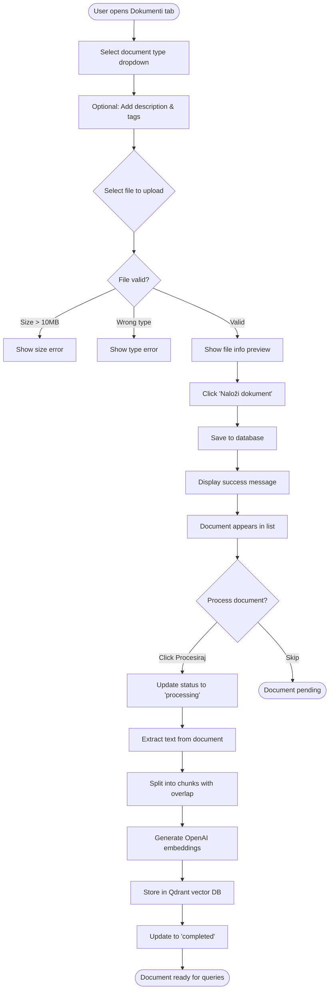
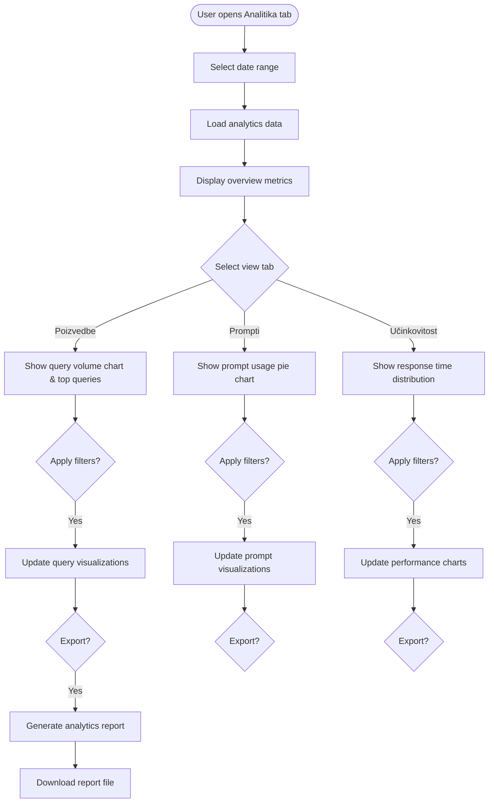

# AI Query Analytics UI/UX Specification

This document defines the user experience goals, information architecture, user flows, and visual design specifications for AI Query Analytics UI's user interface. It serves as the foundation for visual design and frontend development, ensuring a cohesive and user-centered experience.

## Overall UX Goals & Principles

### Target User Personas

- **Administrator:** System managers who need to monitor AI usage, analyze performance metrics, and manage the knowledge base
- **Knowledge Worker:** Users who query the system for information about public procurement processes
- **Data Analyst:** Users who need to export and analyze query patterns and system performance

### Usability Goals

- Ease of learning: New users can perform their first query within 2 minutes
- Efficiency of use: Power users can access analytics and export data with minimal clicks
- Error prevention: Clear validation for document uploads and query inputs
- Memorability: Infrequent users can return to analytics without relearning the interface

### Design Principles

1. **Data transparency** - Show confidence scores, sources, and response times for every query
2. **Progressive disclosure** - Start with query interface, reveal analytics as needed
3. **Slovenian-first** - All UI text in Slovenian with clear, domain-specific terminology
4. **Real-time feedback** - Loading states, progress indicators, and immediate responses
5. **Export-ready** - Data always accessible in downloadable formats

### Change Log

| Date | Version | Description | Author |
|------|---------|-------------|--------|
| 2025-01-15 | 1.0 | Initial specification | Sally (UX Expert) |

## Information Architecture (IA)

### Site Map / Screen Inventory

```mermaid
graph TD
    A[AI Manager Dashboard] --> B[Dokumenti]
    A --> C[Poizvedbe]
    A --> D[Sistemski pozivi]
    A --> E[Nastavitve]
    A --> F[Analitika]
    
    B --> B1[Nalaganje dokumentov]
    B --> B2[Seznam dokumentov]
    B --> B3[Filtriranje po tipu]
    B --> B4[Procesiranje]
    
    C --> C1[Vnos poizvedbe]
    C --> C2[Prikaz odgovora]
    C --> C3[Viri in zanesljivost]
    C --> C4[Zgodovina poizvedb]
    C --> C5[Nedavna iskanja]
    
    D --> D1[Urejanje pozivov]
    D --> D2[Seznam pozivov]
    D --> D3[Verzioniranje]
    
    E --> E1[API povezave]
    E --> E2[Procesiranje nastavitve]
    E --> E3[Model parametri]
    
    F --> F1[Pregled metrik]
    F --> F2[Grafi poizvedb]
    F --> F3[Analiza promptov]
    F --> F4[Učinkovitost sistema]
    F --> F5[Izvoz poročil]
```

### Navigation Structure

**Primary Navigation:** Clean text-based tab navigation with 5 main sections - minimal icon use only where absolutely necessary for clarity (perhaps just a search icon for Poizvedbe tab)

**Secondary Navigation:** Within each tab, text labels and clear typography hierarchy guide users. Actions use text buttons with subtle borders rather than icon buttons.

**Breadcrumb Strategy:** Not needed due to shallow hierarchy (max 2 levels deep). Tab selection with clear text labels provides sufficient context.

## User Flows

### Query Knowledge Base

**User Goal:** Get an answer to a public procurement question from the knowledge base

**Entry Points:** 
- Direct navigation to Poizvedbe tab
- From dashboard/landing page
- From recent queries sidebar

**Success Criteria:** User receives relevant answer with sources and confidence score within 3 seconds

#### Flow Diagram

#### Edge Cases & Error Handling:
- No documents in knowledge base: Show message "Ni najdenih relevantnih dokumentov"
- API timeout: Display "Napaka pri iskanju" with retry option
- Empty query: Disable search button until text entered
- Network failure: Cache query locally and retry when connection restored
- Low confidence results: Highlight confidence < 50% in yellow

**Notes:** Query history persists in session state. Recent queries shown as quick-select buttons for convenience.

### Upload and Process Document

**User Goal:** Add new document to knowledge base for AI processing

**Entry Points:**
- Dokumenti tab
- Quick upload from dashboard (if implemented)

**Success Criteria:** Document uploaded, processed into chunks, and embeddings stored in vector database

#### Flow Diagram

#### Edge Cases & Error Handling:
- Duplicate file: Allow upload but warn user
- PDF/DOCX extraction fails: Mark as 'failed' with error message
- Qdrant unavailable: Queue for later processing
- Partial processing failure: Save successful chunks, log failed ones

**Notes:** Processing can be triggered manually or automated based on settings.

### View Analytics Dashboard

**User Goal:** Analyze system usage and performance metrics

**Entry Points:**
- Analitika tab
- From admin notifications (if implemented)

**Success Criteria:** User can view trends, identify patterns, and export reports

#### Flow Diagram

#### Edge Cases & Error Handling:
- No data for date range: Show empty state with message
- Charts fail to render: Show data in table format as fallback
- Export fails: Show error and offer retry
- Large date ranges: Implement pagination or data sampling

**Notes:** All charts use Plotly for interactivity. Date range affects all tabs simultaneously.

## Wireframes & Mockups

**Primary Design Files:** To be created in Figma/Sketch - link pending

### Key Screen Layouts

#### Query Interface (Poizvedbe) - Chat Pattern

**Purpose:** Conversational interface for natural back-and-forth querying of the knowledge base

**Key Elements:**
- Chat History Container: Scrollable area (height: 60vh) with white background showing conversation flow
- User Messages: Right-aligned bubbles with light gray background (#f5f5f5), max-width 70%
- AI Responses: Left-aligned white cards with subtle shadow, purple left border accent (2px)
- Metadata Bar: Below each AI response - shows time, confidence %, response time, source count
- Input Area: Fixed bottom position with text input and send button
- Session Sidebar: Collapsible right panel showing recent conversations and bookmarked responses

**Interaction Notes:** 
- New messages slide up from bottom with smooth animation
- Typing indicator ("AI razmišlja...") shows during processing
- Sources expand inline within the response card
- Auto-scroll to newest message unless user is scrolling up
- Click on historical query in sidebar to jump to that conversation point

**Design File Reference:** [Figma Frame - Query Interface]

#### Analytics Dashboard (Analitika)

**Purpose:** Comprehensive view of system usage metrics and performance trends

**Key Elements:**
- Date range selector (two date inputs) in top toolbar
- Four metric cards in a row showing key KPIs with trend indicators
- Tab navigation for different chart views (Poizvedbe, Prompti, Učinkovitost)
- Full-width chart area with transparent background
- Data table below charts for detailed information
- Export button positioned top-right of metrics section

**Interaction Notes:** 
- Date changes trigger loading state for all metrics
- Charts have hover tooltips showing exact values
- Tables support sorting by clicking column headers
- Export generates file immediately with loading indicator

**Design File Reference:** [Figma Frame - Analytics Dashboard]

#### Document Management (Dokumenti)

**Purpose:** Upload, categorize, and manage documents in the knowledge base

**Key Elements:**
- Two-column layout: left for upload controls, right for file preview
- Document type dropdown selector (required field)
- Optional description textarea and tags input field
- Drag-and-drop zone with dashed border for file upload
- Document list with expandable rows showing metadata
- Status badges with color coding (pending: yellow, processing: blue, completed: green, failed: red)
- Process and Delete action buttons per document

**Interaction Notes:** 
- Drag-and-drop zone highlights on hover
- File preview shows immediately after selection
- Upload progress bar during file transfer
- Status updates in real-time during processing
- Delete confirmation modal before removal

**Design File Reference:** [Figma Frame - Document Management]

## Component Library / Design System

**Design System Approach:** Custom lightweight component set built on top of Streamlit's default components, maintaining consistency with the existing admin panel gradient styling while adding chat-specific patterns. No external UI framework needed - pure CSS customization of Streamlit components.

### Core Components

#### Message Bubble

**Purpose:** Display user queries and AI responses in a conversational format

**Variants:** 
- User message (right-aligned, gray background)
- AI response (left-aligned, white with purple accent)
- System message (centered, subtle styling)
- Error message (red accent border)

**States:** Default, Loading (with pulsing animation), Expanded (showing sources), Selected (highlighted background)

**Usage Guidelines:** User messages should be concise and right-aligned. AI responses include metadata bar. System messages for status updates only. Maximum width 80% of container to maintain readability.

#### Metric Card

**Purpose:** Display key performance indicators with optional trend indicators

**Variants:**
- Simple metric (number + label)
- Metric with trend (includes up/down arrow and percentage)
- Metric with sub-label (additional context text)

**States:** Default, Loading (skeleton), Updated (brief highlight animation), No data (grayed out)

**Usage Guidelines:** Use for dashboard overview and response metadata. Keep labels short (max 2 words). Format large numbers with commas. Show maximum 4 metrics in a row.

#### Data Table

**Purpose:** Display structured data with sorting and filtering capabilities

**Variants:**
- Basic table (no actions)
- Interactive table (with row actions)
- Expandable table (with detail rows)

**States:** Default, Loading, Empty (with message), Sorted (column indicator), Selected row (highlighted)

**Usage Guidelines:** Zebra stripe for better readability. Sticky header when scrolling. Right-align numerical columns. Maximum 7 columns visible without horizontal scroll.

#### Tab Navigation

**Purpose:** Primary navigation between major sections

**Variants:**
- Text-only tabs
- Tabs with counts (e.g., "Dokumenti (47)")

**States:** Default, Active (gradient background), Hover (subtle background), Disabled (grayed out)

**Usage Guidelines:** Maximum 6 tabs horizontally. Active tab uses purple gradient from admin panel. Maintain tab order consistently. Show counts only when relevant.

#### Progress Indicators

**Purpose:** Show determinate and indeterminate progress states

**Variants:**
- Linear Progress Bar (for file uploads, processing)
- Circular Spinner (for API calls)
- Skeleton Loader (for content loading)
- Typing Indicator (for chat AI responses)
- Step Progress (for multi-phase operations)

**States:** Various by type - see detailed specifications in Animation section

**Usage Guidelines:** Use appropriate indicator for operation duration. Show percentage for operations > 3 seconds. Include time estimates for operations > 10 seconds.

## Branding & Style Guide

### Visual Identity

**Brand Guidelines:** Aligned with existing admin panel design system - professional, gradient-accented, data-focused aesthetic

### Color Palette

| Color Type | Hex Code | Usage |
|------------|----------|--------|
| Primary | #667eea | Primary actions, active states, links |
| Secondary | #764ba2 | Gradient endpoints, hover states |
| Accent | #8b5cf6 | Highlights, focus indicators |
| Success | #10b981 | Positive feedback, completed states |
| Warning | #f59e0b | Cautions, pending states |
| Error | #ef4444 | Errors, failed states, validation |
| Neutral | #6b7280, #e5e7eb, #f9fafb | Text, borders, backgrounds |

### Typography

#### Font Families
- **Primary:** -apple-system, BlinkMacSystemFont, "Segoe UI", Roboto, "Helvetica Neue", sans-serif
- **Secondary:** Same as primary (no secondary needed for this application)
- **Monospace:** "SF Mono", Monaco, "Cascadia Code", "Roboto Mono", monospace

#### Type Scale

| Element | Size | Weight | Line Height |
|---------|------|--------|-------------|
| H1 | 32px | 600 | 1.25 |
| H2 | 24px | 600 | 1.3 |
| H3 | 18px | 500 | 1.4 |
| Body | 14px | 400 | 1.6 |
| Small | 12px | 400 | 1.5 |

### Iconography

**Icon Library:** Streamlit's built-in emoji set for simplicity, with minimal usage per preference

**Usage Guidelines:** Use icons sparingly, only where they add clarity. Prefer text labels over icon-only buttons. System status icons only (✓ success, ✕ error, ⚠ warning). No decorative icons.

### Spacing & Layout

**Grid System:** 8-point grid system (all spacing in multiples of 8px)

**Spacing Scale:** 
- xs: 4px (tight spacing within components)
- sm: 8px (default internal padding)
- md: 16px (section spacing)
- lg: 24px (between major sections)
- xl: 32px (page margins)
- xxl: 48px (major section breaks)

### Shadow and Elevation System

**Elevation Levels:**
- Level 0: Flat (no shadow) - backgrounds, inputs
- Level 1: Raised - `box-shadow: 0 1px 3px rgba(0, 0, 0, 0.12), 0 1px 2px rgba(0, 0, 0, 0.24)`
- Level 2: Floating - `box-shadow: 0 3px 6px rgba(0, 0, 0, 0.15), 0 2px 4px rgba(0, 0, 0, 0.12)`
- Level 3: Overlay - `box-shadow: 0 10px 20px rgba(0, 0, 0, 0.15), 0 3px 6px rgba(0, 0, 0, 0.10)`
- Level 4: Picked Up - `box-shadow: 0 15px 25px rgba(0, 0, 0, 0.15), 0 5px 10px rgba(0, 0, 0, 0.08)`

## Accessibility Requirements

### Compliance Target

**Standard:** WCAG 2.1 Level AA compliance, with select AAA enhancements for critical features

### Key Requirements

**Visual:**
- Color contrast ratios: Normal text 4.5:1, Large text 3:1, Interactive elements 3:1
- Focus indicators: 2px solid outline with 2px offset, #667eea or 3:1 contrast minimum
- Text sizing: Base font 14px minimum, scalable to 200% without horizontal scroll

**Interaction:**
- Keyboard navigation: All functions keyboard accessible, logical tab order, escape closes modals
- Screen reader support: Semantic HTML, ARIA labels, live regions for updates
- Touch targets: Minimum 44x44px for mobile, 8px spacing between targets

**Content:**
- Alternative text: Descriptive alt text for images, text alternatives for charts
- Heading structure: Single H1, hierarchical nesting, descriptive text
- Form labels: Every input has visible label, clear error messages, success confirmations

### Testing Strategy

Automated testing with axe DevTools, Lighthouse CI, and Pa11y. Manual testing with keyboard navigation and screen readers. User testing includes people with disabilities.

## Responsiveness Strategy

### Breakpoints

| Breakpoint | Min Width | Max Width | Target Devices |
|------------|-----------|-----------|----------------|
| Mobile | 320px | 767px | Phones, small tablets in portrait |
| Tablet | 768px | 1023px | Tablets, small laptops |
| Desktop | 1024px | 1439px | Laptops, desktop monitors |
| Wide | 1440px | - | Large monitors, ultra-wide displays |

### Adaptation Patterns

**Layout Changes:** Mobile uses single column stacked layout. Tablet allows two-column layouts. Desktop shows full multi-column layouts. Wide screens center content at 1400px max-width.

**Navigation Changes:** Mobile converts tabs to hamburger menu or horizontal scroll. Tablet shortens labels. Desktop shows full tab labels.

**Content Priority:** Mobile shows query input prominently with hidden history. Tablet shows query with recent searches. Desktop shows all content simultaneously.

**Interaction Changes:** Mobile optimized for touch with larger targets and swipe gestures. Desktop enables full hover states and keyboard shortcuts.

## Animation & Micro-interactions

### Motion Principles

1. **Purposeful:** Every animation serves a function - feedback, guidance, or continuity
2. **Subtle:** Motions are felt, not seen - enhancing rather than distracting
3. **Consistent:** Same actions produce same animations throughout
4. **Responsive:** Immediate feedback for every user action
5. **Natural:** Follow physics - ease in/out, momentum, and natural acceleration

### Key Animations

- **Message Slide In:** New chat messages slide up from bottom with slight bounce (Duration: 300ms, Easing: cubic-bezier(0.68, -0.55, 0.265, 1.55))
- **Typing Indicator Pulse:** Three dots with staggered fade animation showing AI is thinking (Duration: 1.4s cycle, Easing: ease-in-out)
- **Tab Switch Fade:** Content fades out/in when switching tabs (Duration: 150ms out, 200ms in, Easing: ease-in-out)
- **Card Hover Lift:** Cards subtly lift on hover with shadow enhancement (Duration: 200ms, Easing: ease-out)
- **Button Press Scale:** Buttons scale down slightly when pressed (Duration: 100ms, Easing: ease-out)
- **Progress Bar Fill:** Smooth fill animation for determinate progress (Duration: 300ms per update, Easing: ease-in-out)
- **Metric Update Flash:** Brief highlight when metrics update (Duration: 600ms, Easing: ease-out)
- **Error Shake:** Horizontal shake for validation errors (Duration: 600ms, Easing: custom spring)
- **Toast Slide In:** Notifications slide in from right edge (Duration: 250ms, Easing: cubic-bezier(0.68, -0.55, 0.265, 1.55))

### Animation Timing Specifications

**Core Timing Principles:**
- Instant: < 100ms (perceived as immediate)
- Fast: 200-300ms (quick transitions)
- Moderate: 400-600ms (standard animations)
- Slow: 800-1000ms (emphasis animations)

**Spring Physics:**
- Chat messages: stiffness: 260, damping: 20, mass: 1
- Modal appearance: stiffness: 180, damping: 22, mass: 0.7
- Button press: stiffness: 400, damping: 10, mass: 0.5
- Error shake: stiffness: 500, damping: 10, mass: 0.5, velocity: 10

## Performance Considerations

### Performance Goals

- **Page Load:** Initial interactive time < 2 seconds, full load < 3 seconds
- **Interaction Response:** User input feedback < 100ms, action completion < 1 second
- **Animation FPS:** Maintain 60fps for all animations, degrade gracefully on weak devices

### Design Strategies

**Optimized Asset Loading:** Lazy load charts and analytics components. Progressive image loading. Code split by route. Preload critical resources.

**Render Optimization:** Virtual scrolling for long lists. Debounce search input. Throttle scroll events. Use CSS transforms for animations. Implement skeleton screens.

**Data Management:** Cache query responses. Paginate lists. Stream chat responses. Compress large datasets. Use IndexedDB for offline storage.

**Network Optimization:** Batch API requests. Use WebSocket for real-time features. Implement exponential backoff. Cache static assets. Preconnect to API endpoints.

**Memory Management:** Limit DOM elements. Cleanup event listeners. Use object pooling. Clear unused data. Implement garbage collection hints.

## Next Steps

### Immediate Actions

1. Review specification with development team for technical feasibility
2. Create high-fidelity mockups in Figma for key screens (chat interface, analytics dashboard)
3. Prototype the chat interaction pattern for user testing
4. Validate color accessibility with automated tools
5. Set up performance monitoring baseline

### Design Handoff Checklist

- [x] All user flows documented
- [x] Component inventory complete
- [x] Accessibility requirements defined
- [x] Responsive strategy clear
- [x] Brand guidelines incorporated
- [x] Performance goals established

## Checklist Results

✅ User personas defined (Administrator, Knowledge Worker, Data Analyst)  
✅ Information architecture mapped with clear navigation  
✅ Critical user flows documented (Query, Upload, Analytics)  
✅ Chat interface pattern specified with responsive behavior  
✅ Component library defined with states and variants  
✅ Accessibility WCAG AA compliance documented  
✅ Responsive breakpoints and adaptations specified  
✅ Animation and micro-interactions detailed  
✅ Performance goals and strategies established  
✅ Visual identity aligned with existing brand