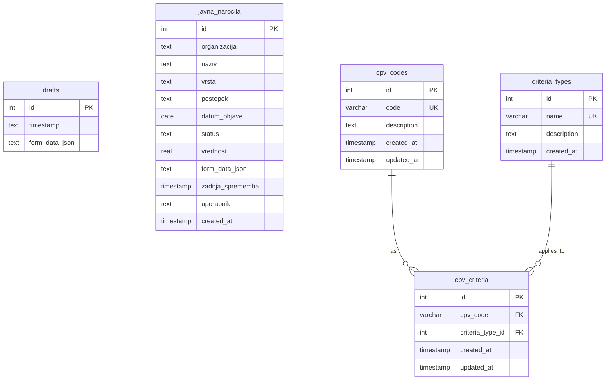

# Database Schema Diagram

## Mermaid ERD Code

## Table Descriptions

### drafts
- Stores draft forms with timestamps and JSON data

### javna_narocila
- Main procurement table containing project information
- Tracks organization, name, type, procedure, status, and value
- Stores complete form data as JSON

### cpv_codes
- Common Procurement Vocabulary codes catalog
- Contains unique codes with descriptions

### criteria_types
- Types of criteria that can be applied to procurements
- Contains unique names with optional descriptions

### cpv_criteria
- Junction table for many-to-many relationship
- Links CPV codes with applicable criteria types
- Enforces unique combinations of cpv_code and criteria_type_id